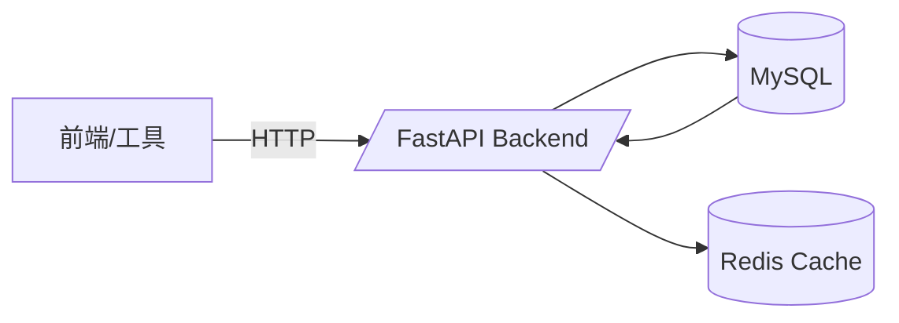
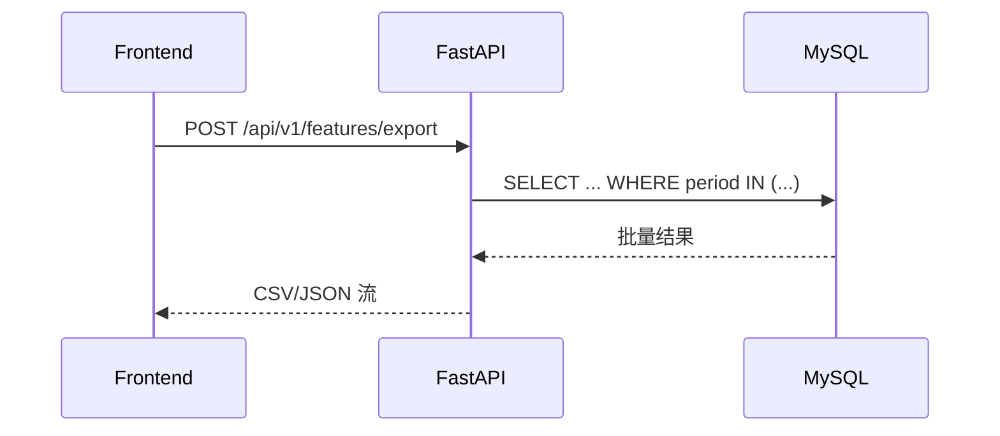

# API 使用文档

## 1. 总览
- Base URL: `http://localhost:8000`
- 认证: 内网自用，无鉴权
- 返回格式: JSON 或 CSV（导出接口）



## 2. 分析结果导出

### `GET /api/v1/analysis/results/export`
| 参数 | 说明 |
| --- | --- |
| `limit` | 默认 200，最大 1000 |
| `offset` | 默认 0 |
| `analysis_type` | 例如 `statistical_analysis`/`strategy_backtest` |
| `export_format` | `json` 或 `csv` |

- JSON 响应: `{ "items": [...], "count": 10, "format": "json" }`
- CSV 响应: `Content-Disposition: attachment; filename="analysis-results-*.csv"`

## 3. 批量特征查询

### `POST /api/v1/features/batch`
```json
{
  "periods": ["20250101001", "20250101002"]
}
```
- 返回 `{ "items": [ { "period": "...", "features": {...} } ], "count": 2 }`
- 自动命中缓存，适合前端刷新或调试。

## 4. 特征导出

### `POST /api/v1/features/export`
| 字段 | 说明 |
| --- | --- |
| `periods` | 必填数组，支持多期 |
| `export_format` | `json` 或 `csv` |

- JSON 返回结构同 batch，只额外包含 `"format": "json"`
- CSV 返回一行一个特征条目：`period,feature_type,schema_version,value,updated_at`

## 5. 使用建议
1. **批量查询优先**：前端勾选多个期号时使用 `/batch`，减少多次请求。
2. **导出工具链**：脚本/BI 想获取可下载文件时，直连 `/analysis/results/export?export_format=csv`，或向 `/features/export` POST 期号集合。
3. **缓存刷新**：若需要实时数据，可在请求前调用 `/health` 或设置 `Cache-Control: no-cache`，配合后台刷新。


