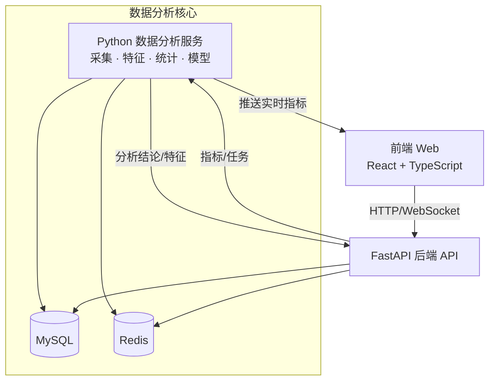
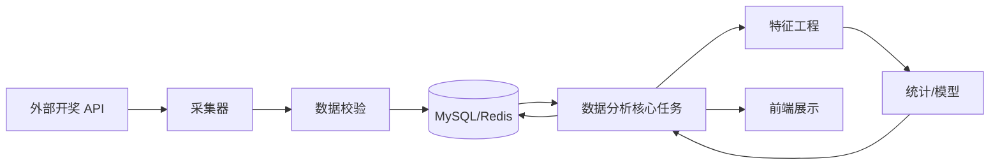
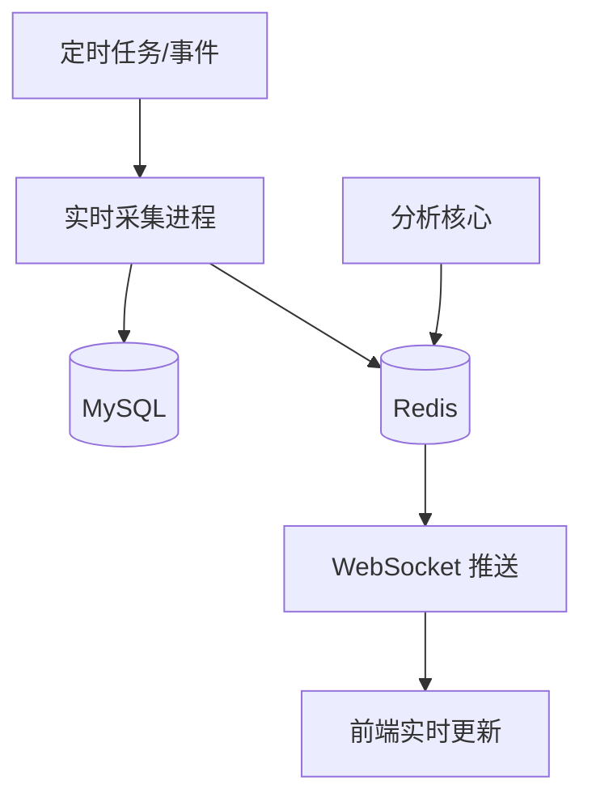

# 技术架构文档

## 1. 系统架构概览

### 1.1 整体架构



### 1.2 技术栈详情

#### 前端技术栈
- **框架**: React 18+
- **语言**: TypeScript
- **UI组件库**: shadcn/ui (基于 Radix UI + Tailwind CSS)
- **状态管理**: Zustand / Redux Toolkit (待定)
- **数据获取**: React Query / SWR (待定)
- **图表库**: Recharts / Chart.js / ECharts (待定)
- **构建工具**: Vite / Next.js (待定)
- **路由**: React Router (如使用Vite) / Next.js Router

#### 后端技术栈
- **API服务**: Python FastAPI（REST + WebSocket，自用场景）
- **数据库**: MySQL 8.0+
- **缓存**: Redis 6.0+
- **ORM**: SQLAlchemy + Alembic
- **认证**: 无（部署在受控环境）
- **API文档**: FastAPI 自动生成的 OpenAPI/Swagger

> 由于后端仅为个人使用，接口数量保持精简，只覆盖开奖数据查询、策略结果写入等核心能力。

#### 数据分析技术栈
- **语言**: Python 3.9+
- **数据处理**: pandas, numpy
- **统计分析**: scipy, statsmodels
- **机器学习**: scikit-learn (可选)
- **数据采集**: requests, aiohttp
- **可视化**: matplotlib, seaborn, plotly

### 1.3 数据分析优先级

- **定位**：数据分析服务是项目最重要的产出层，负责生成所有报表、特征、策略信号；其需求优先级高于前端与后端。
- **依赖关系**：前端只承担结果展示，后端 FastAPI 只负责触发分析、传输结果和少量 CRUD，二者必须围绕分析服务的接口契约演进。
- **资源倾斜**：算力、存储与开发时间先满足 `analysis/` 目录中的采集、特征、统计和模型任务，其余模块仅保留支撑性实现。

---

## 2. 项目结构

### 2.1 目录结构

```
project-root/
├── frontend/                 # 前端项目
│   ├── src/
│   │   ├── components/       # React组件
│   │   │   ├── ui/          # shadcn/ui组件
│   │   │   ├── charts/      # 图表组件
│   │   │   └── layout/      # 布局组件
│   │   ├── pages/           # 页面
│   │   │   ├── dashboard/   # 仪表板
│   │   │   ├── analysis/    # 分析页面
│   │   │   └── settings/    # 设置页面
│   │   ├── hooks/           # 自定义Hooks
│   │   ├── services/        # API服务
│   │   ├── store/           # 状态管理
│   │   ├── types/           # TypeScript类型定义
│   │   └── utils/           # 工具函数
│   ├── public/
│   ├── package.json
│   └── tsconfig.json
│
├── backend/                  # 后端API服务
│   ├── src/
│   │   ├── controllers/     # 控制器
│   │   ├── services/        # 业务逻辑
│   │   ├── models/          # 数据模型
│   │   ├── routes/          # 路由
│   │   ├── middleware/      # 中间件
│   │   └── utils/           # 工具函数
│   ├── config/              # 配置文件
│   └── package.json / requirements.txt
│
├── analysis/                 # 数据分析服务
│   ├── src/
│   │   ├── data_collector.py      # 数据采集
│   │   ├── feature_engineering.py # 特征工程
│   │   ├── statistical_analysis.py # 统计分析
│   │   ├── time_series_analysis.py # 时间序列
│   │   ├── markov_analysis.py      # 状态转移
│   │   └── strategy_backtest.py   # 策略回测
│   ├── data/                # 数据文件
│   ├── notebooks/           # Jupyter notebooks
│   └── requirements.txt
│
├── database/                # 数据库相关
│   ├── migrations/          # 数据库迁移
│   ├── seeds/              # 种子数据
│   └── schema.sql          # 数据库结构
│
├── docs/                    # 文档
│   ├── 需求文档.md
│   ├── 技术架构.md
│   ├── 腾讯分分彩分析框架.md
│   └── API文档.md
│
└── docker/                  # Docker配置 (可选)
    ├── docker-compose.yml
    ├── Dockerfile.frontend
    ├── Dockerfile.backend
    └── Dockerfile.analysis
```

> `analysis/` 目录定义了项目的核心交付内容，其接口、数据结构与任务编排决定了前端页面和 FastAPI API 的形态；任何结构调整必须优先在数据分析模块落地，再同步到其他目录。

---

## 3. 数据库设计
### 3.1 MySQL 表结构

> 表结构围绕“raw → validated → features → analysis”分层，任何阶段都能回放与追溯。

#### 原始开奖表(raw_lottery_draws)
`sql
CREATE TABLE raw_lottery_draws (
    id BIGINT PRIMARY KEY AUTO_INCREMENT,
    period VARCHAR(50) NOT NULL COMMENT '期号',
    payload JSON NOT NULL COMMENT '原始API响应',
    source VARCHAR(50) NOT NULL COMMENT '数据来源接口/代理',
    fetched_at DATETIME NOT NULL COMMENT '采集时间',
    status VARCHAR(20) DEFAULT 'pending' COMMENT '校验状态',
    UNIQUE KEY uniq_period_source (period, source),
    INDEX idx_fetched_at (fetched_at)
) ENGINE=InnoDB DEFAULT CHARSET=utf8mb4 COMMENT='采集阶段原始数据';
`

#### 开奖数据表(lottery_draws)
`sql
CREATE TABLE lottery_draws (
    id BIGINT PRIMARY KEY AUTO_INCREMENT,
    period VARCHAR(50) UNIQUE NOT NULL COMMENT '期号',
    draw_time DATETIME NOT NULL COMMENT '开奖时间',
    timestamp BIGINT NOT NULL COMMENT 'Unix时间戳',
    numbers JSON NOT NULL COMMENT '开奖号码数组',
    sum INT COMMENT '和值',
    span INT COMMENT '跨度',
    odd_even VARCHAR(10) COMMENT '奇偶方向',
    big_small VARCHAR(10) COMMENT '大小方向',
    created_at TIMESTAMP DEFAULT CURRENT_TIMESTAMP,
    updated_at TIMESTAMP DEFAULT CURRENT_TIMESTAMP ON UPDATE CURRENT_TIMESTAMP,
    INDEX idx_draw_time (draw_time),
    INDEX idx_period (period),
    INDEX idx_timestamp (timestamp)
) ENGINE=InnoDB DEFAULT CHARSET=utf8mb4 COMMENT='整理后开奖数据';
`

#### 校验日志表(validation_logs)
`sql
CREATE TABLE validation_logs (
    id BIGINT PRIMARY KEY AUTO_INCREMENT,
    period VARCHAR(50) NOT NULL COMMENT '期号',
    check_item VARCHAR(50) NOT NULL COMMENT '校验项',
    status VARCHAR(20) NOT NULL COMMENT 'pass/fail',
    detail JSON NULL COMMENT '失败原因',
    created_at TIMESTAMP DEFAULT CURRENT_TIMESTAMP,
    INDEX idx_period (period)
) ENGINE=InnoDB DEFAULT CHARSET=utf8mb4 COMMENT='数据质量日志';
`

#### 特征数据表(lottery_features)
`sql
CREATE TABLE lottery_features (
    id BIGINT PRIMARY KEY AUTO_INCREMENT,
    period VARCHAR(50) NOT NULL COMMENT '期号',
    feature_type VARCHAR(50) NOT NULL COMMENT '特征类型',
    feature_value JSON NOT NULL COMMENT '特征值',
    created_at TIMESTAMP DEFAULT CURRENT_TIMESTAMP,
    FOREIGN KEY (period) REFERENCES lottery_draws(period),
    INDEX idx_period (period),
    INDEX idx_feature_type (feature_type)
) ENGINE=InnoDB DEFAULT CHARSET=utf8mb4 COMMENT='特征数据';
`

#### 分析结果表(analysis_results)
`sql
CREATE TABLE analysis_results (
    id BIGINT PRIMARY KEY AUTO_INCREMENT,
    analysis_type VARCHAR(50) NOT NULL COMMENT '分析类型',
    result_data JSON NOT NULL COMMENT '分析结果',
    created_at TIMESTAMP DEFAULT CURRENT_TIMESTAMP,
    INDEX idx_analysis_type (analysis_type),
    INDEX idx_created_at (created_at)
) ENGINE=InnoDB DEFAULT CHARSET=utf8mb4 COMMENT='分析结果';
`

#### 分析任务表(analysis_jobs)
`sql
CREATE TABLE analysis_jobs (
    id BIGINT PRIMARY KEY AUTO_INCREMENT,
    job_type VARCHAR(50) NOT NULL COMMENT '任务类型',
    payload JSON NOT NULL COMMENT '任务参数',
    status VARCHAR(20) NOT NULL DEFAULT 'pending',
    started_at DATETIME NULL,
    finished_at DATETIME NULL,
    result_id BIGINT NULL,
    FOREIGN KEY (result_id) REFERENCES analysis_results(id),
    INDEX idx_status (status),
    INDEX idx_job_type (job_type)
) ENGINE=InnoDB DEFAULT CHARSET=utf8mb4 COMMENT='分析调度任务';
`
### 3.2 Redis 缓存策略

#### 缓存键设计
```
lottery:draws:latest          # 最新开奖数据
lottery:draws:period:{period} # 指定期号数据
lottery:stats:daily:{date}     # 每日统计数据
lottery:analysis:{type}       # 分析结果缓存
```

#### 缓存过期时间
- 最新数据: 60秒 (与开奖频率一致)
- 历史数据: 24小时
- 统计数据: 1小时
- 分析结果: 30分钟

---

## 4. API 设计

### 4.1 RESTful API 端点

#### 开奖数据相关
```
GET    /api/v1/draws              # 获取开奖数据列表
GET    /api/v1/draws/:period      # 获取指定期号数据
GET    /api/v1/draws/latest       # 获取最新开奖数据
GET    /api/v1/draws/range        # 获取日期范围数据
```

#### 分析相关
```
GET    /api/v1/analysis/frequency      # 频率分析
GET    /api/v1/analysis/statistics     # 统计分析
GET    /api/v1/analysis/time-series    # 时间序列分析
GET    /api/v1/analysis/markov         # 状态转移分析
POST   /api/v1/analysis/run            # 执行分析
```

#### 特征相关
```
GET    /api/v1/features              # 获取特征数据
GET    /api/v1/features/:period      # 获取指定期号特征
POST   /api/v1/features/calculate     # 计算特征
```

### 4.2 WebSocket 端点

```
WS     /ws/draws                    # 实时开奖数据推送
WS     /ws/analysis                 # 分析结果推送
```

---

## 5. 前端页面规划

### 5.1 主要页面

1. **仪表板 (Dashboard)**
   - 最新开奖数据展示
   - 关键统计指标
   - 实时数据更新

2. **数据分析页面**
   - 频率分布分析
   - 时间序列图表
   - 状态转移可视化
   - 统计分析结果

3. **历史数据页面**
   - 数据列表展示
   - 筛选和搜索
   - 数据导出

4. **设置页面**
   - 分析参数配置
   - 数据采集设置
   - 系统配置

### 5.2 组件设计

#### shadcn/ui 组件使用
- `Card` - 数据卡片
- `Table` - 数据表格
- `Chart` - 图表容器
- `Button` - 按钮
- `Input` - 输入框
- `Select` - 下拉选择
- `Dialog` - 对话框
- `Tabs` - 标签页

#### 自定义组件
- `DrawCard` - 开奖数据卡片
- `FrequencyChart` - 频率分布图表
- `TimeSeriesChart` - 时间序列图表
- `AnalysisResult` - 分析结果展示

---

## 6. 数据流设计

### 6.1 数据采集流程



1. **采集层**：`Collector` 抓取数据后写入 `raw_lottery_draws`，并记录 `source`、`fetched_at` 与 `status`。
2. **校验层**：`Validator` 读取 raw 数据，落 `validation_logs`；通过的记录才会生成 `lottery_draws`。
3. **分析层**：`Analysis/Feature/Stats` 逐步生成 `lottery_features` 与 `analysis_results`，同时触发 `analysis_jobs` 状态变更。
4. **存储与消费**：处理完的数据写回 `MySQL/Redis`，供 FastAPI API 及前端使用。

### 6.2 实时数据更新



- `Collector` 成功写入 MySQL/Redis 后触发 `analysis_jobs` 或直接通知分析核心计算最新指标。
- `Analysis` 核心会把实时指标缓存到 Redis (`lottery:analysis:*`)，再由 WebSocket 推送。
- 前端仅消费缓存结果，不直接访问分析服务，确保数据分析资源集中。

---

## 7. 开发环境配置

### 7.1 前端环境

```json
// package.json (示例)
{
  "dependencies": {
    "react": "^18.2.0",
    "react-dom": "^18.2.0",
    "typescript": "^5.0.0",
    "@radix-ui/react-*": "...",
    "tailwindcss": "^3.0.0",
    "recharts": "^2.8.0",
    "axios": "^1.5.0"
  }
}
```

### 7.2 后端环境

```txt
# requirements.txt (FastAPI 后端)
fastapi>=0.110.0
uvicorn[standard]>=0.29.0
SQLAlchemy>=2.0.0
alembic>=1.13.0
redis>=5.0.0
python-dotenv>=1.0.0
tenacity>=8.2.0
```

```txt
# requirements-analysis.txt (Python数据分析)
pandas>=2.0.0
numpy>=1.24.0
scipy>=1.10.0
statsmodels>=0.14.0
requests>=2.31.0
mysql-connector-python>=8.1.0
redis>=5.0.0
```

### 7.3 数据库配置

```env
# .env
MYSQL_HOST=localhost
MYSQL_PORT=3306
MYSQL_DATABASE=lottery_analysis
MYSQL_USER=root
MYSQL_PASSWORD=your_password

REDIS_HOST=localhost
REDIS_PORT=6379
REDIS_PASSWORD=
```

---

## 8. 部署方案

### 8.1 开发环境
- 前端: Vite dev server (localhost:5173，保持不变)
- 后端: Python FastAPI dev server (localhost:8000，uvicorn，免认证)
- 数据库: 本地MySQL + Redis

### 8.2 生产环境
- 前端: Nginx + 静态文件
- 后端: Uvicorn/Gunicorn（FastAPI，自用部署，无需额外认证）
- 数据库: MySQL主从 + Redis集群
- 数据分析: 独立Python服务

### 8.3 Docker部署 (可选)
- 使用docker-compose编排所有服务
- 前端、后端、数据库、Redis容器化

---

## 9. 安全考虑

### 9.1 API安全
- 内部白名单/IP 限制访问（不启用 JWT 等用户体系）
- 通过防火墙与反向代理限制端口暴露
- CORS 仅允许本地前端域名
- 输入验证和SQL注入防护

### 9.2 数据安全
- 数据库连接加密
- 敏感信息环境变量管理
- 定期数据备份

---

## 10. 性能优化

### 10.1 前端优化
- 代码分割和懒加载
- 图片和资源优化
- 虚拟滚动 (大数据列表)
- 图表数据缓存

### 10.2 后端优化
- Redis缓存热点数据
- 数据库索引优化
- API响应压缩
- 异步任务处理

### 10.3 数据分析优化
- 批量处理数据
- 增量计算
- 结果缓存
- 并行计算

---

**文档版本：** v1.0  
**最后更新：** 2025-01-XX  
**维护者：** 开发团队

