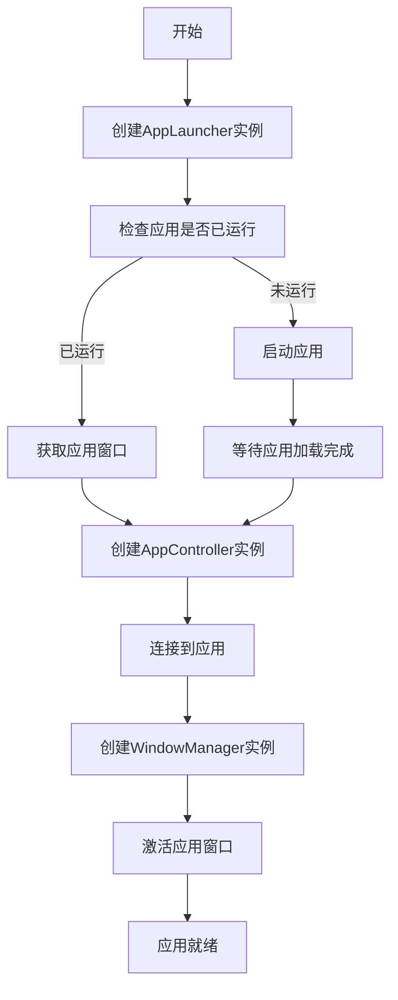
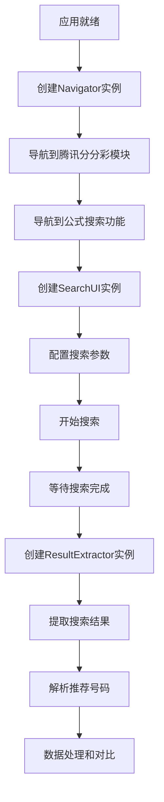

# 桌面应用自动化架构修正方案

## 问题概述

当前架构设计与PRD文档要求存在偏差，主要问题是未充分考虑"公式搜索是在桌面应用中实现的"这一关键点。本方案旨在修正架构，确保完全符合桌面应用自动化的需求。

## 修正后的架构设计

### 1. 技术栈调整

#### 1.1 核心技术选择
- **主自动化框架**: Pywinauto (主要) + PyAutoGUI (辅助)
  - Pywinauto: 用于Windows应用程序的UI自动化，支持控件识别和操作
  - PyAutoGUI: 用于基于图像识别的操作，作为Pywinauto的补充
- **OCR识别**: Tesseract + pytesseract (用于识别无法通过控件获取的文本)
- **图像处理**: OpenCV + numpy (用于图像识别和模板匹配)
- **API调用**: requests (保持不变)
- **数据处理**: pandas (增强数据处理能力)

#### 1.2 技术选择理由
- Pywinauto更适合Windows桌面应用自动化，可以直接识别和操作窗口控件
- OCR和图像识别技术可以处理无法直接通过控件获取的信息
- 桌面应用自动化需要更多的容错和重试机制

### 2. 修正后的目录结构

```
PC-Test/
├── main.py                     # 应用程序入口点
├── requirements.txt            # 项目依赖
├── README.md                   # 项目说明文档
├── config/                     # 配置文件目录
│   ├── settings.py            # 应用程序设置
│   ├── config.json            # 配置文件
│   └── app_config.json        # 桌面应用特定配置
├── memory-bank/               # 项目记忆库
│   ├── game-design-document.md  # 项目设计文档
│   ├── tech-stack.md          # 技术栈文档
│   ├── implementation-plan.md  # 实施计划
│   ├── architecture.md        # 原架构文档
│   ├── architecture_fixed.md  # 修正后架构文档(本文件)
│   └── progress.md            # 进度跟踪
├── src/                       # 源代码目录
│   ├── __init__.py
│   ├── core/                  # 核心抽象层
│   │   ├── __init__.py
│   │   ├── interfaces/        # 接口定义
│   │   │   ├── __init__.py
│   │   │   ├── i_automator.py # 自动化接口
│   │   │   ├── i_app_controller.py # 应用控制接口
│   │   │   └── i_data_processor.py # 数据处理接口
│   │   └── base/              # 基础实现类
│   │       ├── __init__.py
│   │       ├── base_automator.py # 自动化基类
│   │       └── base_app_controller.py # 应用控制基类
│   ├── desktop/                # 桌面应用自动化模块
│   │   ├── __init__.py
│   │   ├── app_launcher.py    # 应用启动器
│   │   ├── app_controller.py  # 应用控制器
│   │   ├── window_manager.py  # 窗口管理器
│   │   ├── element_finder.py  # 元素查找器
│   │   └── interaction.py     # 交互操作
│   ├── ui/                    # UI自动化模块
│   │   ├── __init__.py
│   │   ├── navigator.py       # 界面导航
│   │   ├── search_ui.py       # 搜索界面操作
│   │   └── result_extractor.py # 结果提取
│   ├── vision/                # 视觉识别模块
│   │   ├── __init__.py
│   │   ├── ocr_reader.py      # OCR文本识别
│   │   ├── image_matcher.py   # 图像匹配
│   │   └── template_manager.py # 模板管理
│   ├── data/                  # 数据处理模块
│   │   ├── __init__.py
│   │   ├── models.py          # 数据模型
│   │   ├── processors.py      # 数据处理器
│   │   └── validators.py      # 数据验证器
│   ├── api/                   # API接口模块
│   │   ├── __init__.py
│   │   └── lottery_api.py     # 彩票API接口
│   ├── exception/             # 异常处理模块
│   │   ├── __init__.py
│   │   └── custom_exceptions.py # 自定义异常
│   └── utils/                 # 工具模块
│       ├── __init__.py
│       ├── logger.py          # 日志工具
│       ├── config_loader.py   # 配置加载器
│       └── retry_handler.py   # 重试处理器
├── tests/                     # 测试目录
│   ├── __init__.py
│   ├── unit/                  # 单元测试
│   └── integration/           # 集成测试
├── logs/                      # 日志目录
├── data/                      # 数据目录
│   ├── history/               # 历史数据
│   └── results/               # 结果数据
└── assets/                    # 资源目录
    ├── templates/             # 图像模板
    │   ├── search_button.png
    │   ├── stop_button.png
    │   └── result_table.png
    └── configs/               # 配置文件
        └── element_locators.json # 元素定位配置
```

### 3. 核心模块设计

#### 3.1 桌面应用自动化模块 (src/desktop/)

##### 3.1.1 AppLauncher (app_launcher.py)

**职责**：启动和管理桌面应用程序

**主要功能**：
- 启动「奇趣腾讯分分彩」桌面应用
- 检测应用是否已运行
- 获取应用窗口句柄
- 处理应用启动异常

**接口**：
```python
class AppLauncher:
    def __init__(self, app_path: str, config: dict)
    def launch(self) -> bool
    def is_running(self) -> bool
    def get_window_handle(self) -> int
    def wait_for_ready(self, timeout: int = 30) -> bool
    def close(self) -> bool
```

##### 3.1.2 AppController (app_controller.py)

**职责**：控制桌面应用程序

**主要功能**：
- 连接到应用程序
- 管理应用程序状态
- 处理应用程序异常
- 提供应用程序操作接口

**接口**：
```python
class AppController:
    def __init__(self, app_launcher: AppLauncher)
    def connect(self) -> bool
    def is_connected(self) -> bool
    def get_app_state(self) -> AppState
    def activate_window(self) -> bool
    def minimize_window(self) -> bool
    def maximize_window(self) -> bool
    def close_connection(self) -> bool
```

##### 3.1.3 WindowManager (window_manager.py)

**职责**：管理应用程序窗口

**主要功能**：
- 窗口识别和定位
- 窗口状态管理
- 窗口操作（最大化、最小化、激活等）
- 多窗口处理

**接口**：
```python
class WindowManager:
    def __init__(self, app_controller: AppController)
    def find_window(self, title_pattern: str) -> Optional[int]
    def get_window_rect(self, window_handle: int) -> Tuple[int, int, int, int]
    def set_window_foreground(self, window_handle: int) -> bool
    def is_window_visible(self, window_handle: int) -> bool
    def wait_for_window(self, title_pattern: str, timeout: int = 10) -> Optional[int]
```

##### 3.1.4 ElementFinder (element_finder.py)

**职责**：查找和识别界面元素

**主要功能**：
- 基于控件属性的元素查找
- 基于坐标的元素定位
- 基于图像识别的元素查找
- 元素属性获取

**接口**：
```python
class ElementFinder:
    def __init__(self, app_controller: AppController)
    def find_element_by_control_id(self, control_id: str) -> Optional[ElementInfo]
    def find_element_by_text(self, text: str) -> Optional[ElementInfo]
    def find_element_by_image(self, template_path: str) -> Optional[ElementInfo]
    def find_elements_by_class(self, class_name: str) -> List[ElementInfo]
    def get_element_properties(self, element: ElementInfo) -> Dict[str, Any]
```

##### 3.1.5 Interaction (interaction.py)

**职责**：执行界面交互操作

**主要功能**：
- 点击操作
- 文本输入
- 选择操作
- 拖拽操作

**接口**：
```python
class Interaction:
    def __init__(self, app_controller: AppController, element_finder: ElementFinder)
    def click(self, element: ElementInfo) -> bool
    def double_click(self, element: ElementInfo) -> bool
    def right_click(self, element: ElementInfo) -> bool
    def input_text(self, element: ElementInfo, text: str) -> bool
    def select_option(self, element: ElementInfo, option: str) -> bool
    def set_checkbox(self, element: ElementInfo, checked: bool) -> bool
```

#### 3.2 UI自动化模块 (src/ui/)

##### 3.2.1 Navigator (navigator.py)

**职责**：导航到指定界面

**主要功能**：
- 导航到「腾讯分分彩」模块
- 导航到「公式搜索」功能
- 界面状态检测

**接口**：
```python
class Navigator:
    def __init__(self, app_controller: AppController, element_finder: ElementFinder, interaction: Interaction)
    def navigate_to_lottery_module(self) -> bool
    def navigate_to_formula_search(self) -> bool
    def wait_for_page_load(self, page_identifier: str, timeout: int = 10) -> bool
    def get_current_page(self) -> Optional[str]
```

##### 3.2.2 SearchUI (search_ui.py)

**职责**：操作搜索界面

**主要功能**：
- 配置搜索参数
- 执行搜索操作
- 停止搜索操作
- 清除搜索结果

**接口**：
```python
class SearchUI:
    def __init__(self, app_controller: AppController, element_finder: ElementFinder, interaction: Interaction)
    def configure_search_parameters(self, params: SearchParameters) -> bool
    def start_search(self) -> bool
    def stop_search(self) -> bool
    def clear_results(self) -> bool
    def is_search_running(self) -> bool
    def wait_for_search_complete(self, timeout: int = 60) -> bool
```

##### 3.2.3 ResultExtractor (result_extractor.py)

**职责**：提取搜索结果

**主要功能**：
- 定位结果表格
- 提取表格数据
- 解析推荐号码

**接口**：
```python
class ResultExtractor:
    def __init__(self, app_controller: AppController, element_finder: ElementFinder, ocr_reader: OCRReader)
    def extract_top_results(self, count: int = 5) -> List[SearchResult]
    def parse_recommended_numbers(self, result_text: str) -> List[int]
    def extract_table_data(self) -> List[Dict[str, Any]]
    def is_result_table_loaded(self) -> bool
```

#### 3.3 视觉识别模块 (src/vision/)

##### 3.3.1 OCRReader (ocr_reader.py)

**职责**：使用OCR识别文本

**主要功能**：
- 从屏幕区域识别文本
- 从图像识别文本
- 文本后处理和验证

**接口**：
```python
class OCRReader:
    def __init__(self, language: str = 'chi_sim+eng')
    def recognize_text_from_screen(self, region: Tuple[int, int, int, int]) -> str
    def recognize_text_from_image(self, image_path: str) -> str
    def recognize_text_from_element(self, element: ElementInfo) -> str
    def preprocess_image(self, image: np.ndarray) -> np.ndarray
```

##### 3.3.2 ImageMatcher (image_matcher.py)

**职责**：基于图像匹配查找元素

**主要功能**：
- 模板匹配
- 多尺度匹配
- 匹配结果过滤

**接口**：
```python
class ImageMatcher:
    def __init__(self, threshold: float = 0.8)
    def find_template(self, template_path: str, region: Optional[Tuple[int, int, int, int]] = None) -> Optional[Tuple[int, int]]
    def find_all_templates(self, template_path: str, region: Optional[Tuple[int, int, int, int]] = None) -> List[Tuple[int, int]]
    def match_template(self, source: np.ndarray, template: np.ndarray) -> float
```

### 4. 桌面应用自动化流程

#### 4.1 应用启动流程



#### 4.2 搜索流程



### 5. 配置管理

#### 5.1 应用配置 (config/app_config.json)

```json
{
  "app": {
    "name": "奇趣腾讯分分彩",
    "path": "C:\\Program Files\\Tencent\\Lottery\\Lottery.exe",
    "window_title_pattern": "*腾讯分分彩*",
    "startup_timeout": 30,
    "operation_timeout": 10
  },
  "search": {
    "formula_count": 100,
    "data_periods": 200,
    "fixed_numbers": 5,
    "plan_cycle": 1,
    "accuracy_threshold": 57
  },
  "automation": {
    "retry_count": 3,
    "retry_interval": 2,
    "operation_delay": 0.5,
    "screenshot_on_failure": true
  }
}
```

#### 5.2 元素定位配置 (assets/configs/element_locators.json)

```json
{
  "lottery_module": {
    "locator_type": "text",
    "locator_value": "腾讯分分彩"
  },
  "formula_search": {
    "locator_type": "text",
    "locator_value": "公式搜索"
  },
  "search_button": {
    "locator_type": "control_id",
    "locator_value": "btnSearch"
  },
  "stop_button": {
    "locator_type": "control_id",
    "locator_value": "btnStop"
  },
  "result_table": {
    "locator_type": "control_id",
    "locator_value": "gridResults"
  }
}
```

### 6. 错误处理和重试机制

#### 6.1 桌面应用特有异常

```python
class AppNotRunningException(Exception):
    """应用程序未运行异常"""
    pass

class WindowNotFoundException(Exception):
    """窗口未找到异常"""
    pass

class ElementNotFoundException(Exception):
    """元素未找到异常"""
    pass

class OperationFailedException(Exception):
    """操作失败异常"""
    pass
```

#### 6.2 重试策略

```python
class RetryHandler:
    def __init__(self, max_retries: int = 3, base_delay: float = 1.0):
        self.max_retries = max_retries
        self.base_delay = base_delay
    
    def retry_with_backoff(self, func, *args, **kwargs):
        for attempt in range(self.max_retries + 1):
            try:
                return func(*args, **kwargs)
            except Exception as e:
                if attempt == self.max_retries:
                    raise e
                
                delay = self.base_delay * (2 ** attempt)
                time.sleep(delay)
                logger.warning(f"操作失败，{delay}秒后重试 (尝试 {attempt + 1}/{self.max_retries + 1}): {str(e)}")
```

### 7. 测试策略

#### 7.1 单元测试

- 测试各个模块的核心功能
- 使用模拟对象隔离依赖
- 重点测试错误处理和边界条件

#### 7.2 集成测试

- 测试模块间的协作
- 测试完整的自动化流程
- 使用真实应用进行测试

#### 7.3 视觉回归测试

- 保存关键界面的截图
- 定期比对当前界面与基准截图
- 检测UI变化导致的自动化失败

### 8. 部署和维护

#### 8.1 部署注意事项

- 确保目标环境安装了必要的依赖
- 配置正确的应用路径
- 预先准备图像模板和配置文件

#### 8.2 维护策略

- 定期更新元素定位配置
- 监控应用UI变化
- 建立自动化失败的报警机制

## 总结

本修正方案充分考虑了桌面应用自动化的特点，重新设计了架构，确保完全符合PRD文档的要求。主要改进包括：

1. 专注于桌面应用自动化，使用Pywinauto作为主要技术栈
2. 增加了视觉识别模块，处理无法通过控件获取的信息
3. 设计了专门的窗口管理和元素查找功能
4. 提供了完整的错误处理和重试机制
5. 制定了针对桌面应用的测试策略

这个修正后的架构将更好地支持腾讯分分彩桌面应用的自动化操作，确保项目能够按照PRD文档的要求成功实现。